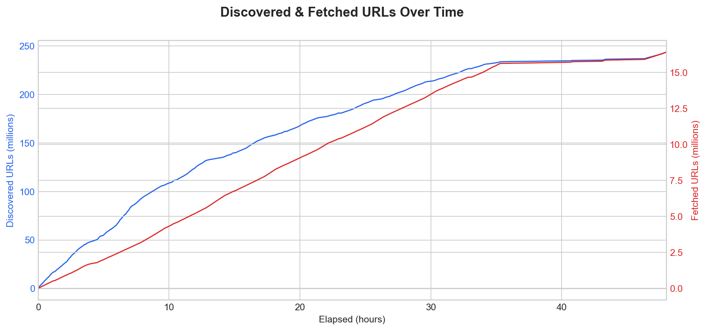
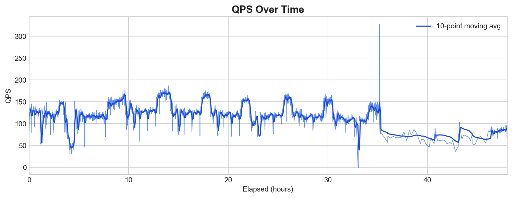
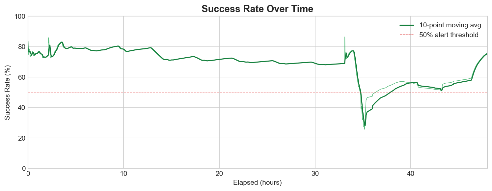
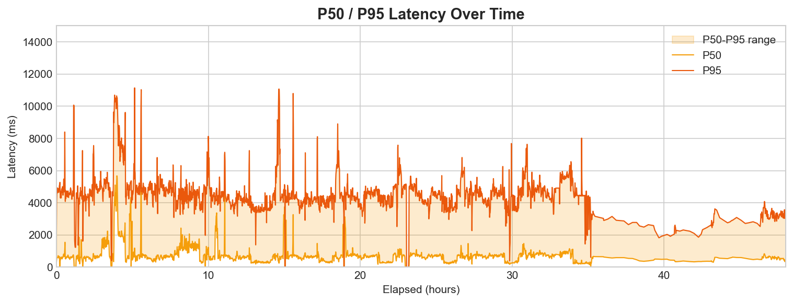
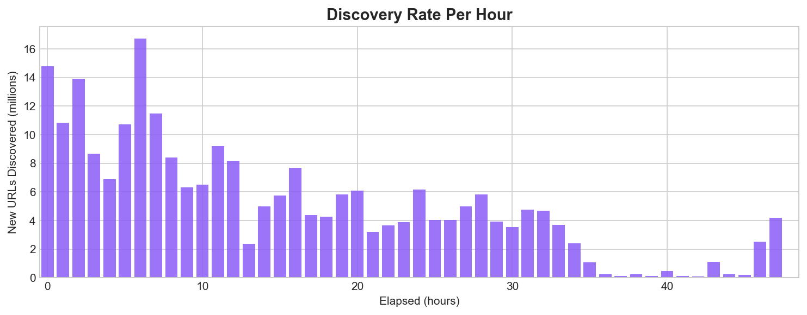
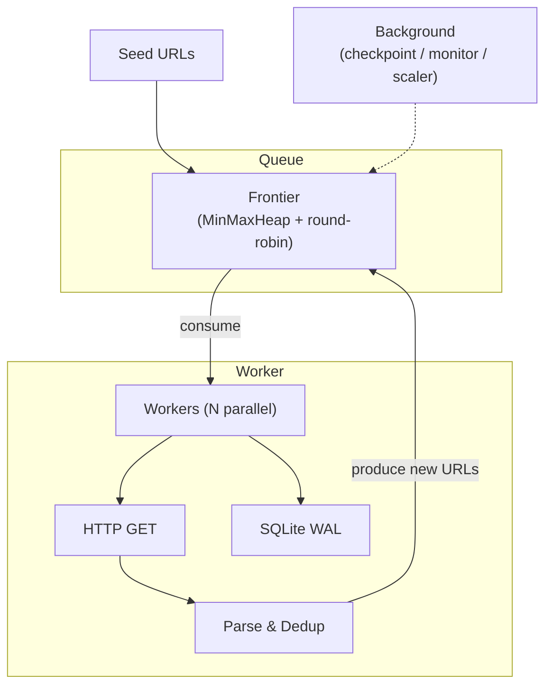

# web-weave

Rust 單機 URL crawler。從 1,000 個 seed URLs 出發, 在 48 小時內最大化 URL discovery, 同時嚴格遵守 politeness constraints。

## Results (48-hour Crawl)

| Metric | Value |
|--------|-------|
| Total Discovered URLs | ~243.6M |
| Total Fetched URLs | ~16.4M |
| Unique Domains Reached | ~1.9M |
| Sustained QPS | ~120 |
| Success Rate | 68-76% |
| Median Latency (p50) | ~500 ms |

### Performance Charts











### Incident Note

在 T+33h 左右發生意外關機, 導致所有 TCP connections 斷開, process 陷入 idle 狀態 (QPS 降至 0)。透過 `RESUME=true` restart 後, 系統從 checkpoint 恢復。但 backoff state 在非 graceful shutdown 下未能完整保存 (僅 8 bytes), 導致大量 bad domains 被重新嘗試, success rate 從 ~70% 暴跌至 ~25%。後續透過調整 backoff threshold (3 -> 1) 與 backoff base (30s -> 5min), 並保留 failure history 跨 cleanup cycle, success rate 逐步恢復至 ~60-75%。

## Build & Run

```bash
cargo build --release
cargo run --release

# 自訂設定
CRAWL_HOURS=1 NUM_WORKERS=200 RESUME=true cargo run --release

# 從上次 checkpoint resume
RESUME=true cargo run --release
```

| 變數 | 預設值 | 說明 |
|------|--------|------|
| `SEED_FILE` | `urls.txt` | Seed URL 檔案路徑 |
| `DB_PATH` | `web_weave.db` | SQLite database 路徑 |
| `NUM_WORKERS` | `800` | 最大 worker 數量 |
| `CRAWL_HOURS` | `48` | Crawl 時長 (小時) |
| `CRAWL_MINS` | `0` | 額外 crawl 時長 (分鐘) |
| `RESUME` | `false` | 從上次 checkpoint resume |

## Architecture



每個 worker 的 pipeline: pop URL -> check backoff -> check robots.txt -> rate limit (0.5 QPS/domain) -> HTTP GET -> parse links -> dedup -> score & push。

## Politeness

- **每 domain 0.5 QPS**: Governor keyed rate limiter, 每 2 秒 1 request, burst=1, 在 HTTP request 發出前強制執行。
- **遵守 robots.txt**: 首次存取 domain 時 fetch 並 cache 24h。Disallowed URLs 完全 skip。支援 `crawl-delay` 與 sitemap extraction。

## Core Design

**Frontier**: Per-domain MinMaxHeap 搭配 round-robin scheduling。Smart admission: domain queue 滿 (5 URLs) 時, 若新 URL score 更高則 replace 最低分。容量 5M URLs。

**URL Scoring**:
```
score = (MAX_DEPTH - depth) * 10.0 + (50.0 if new domain) + (30.0 if from sitemap)
```

**Dynamic Scaling**: Scaler 每 30 秒根據 live metrics 調整 worker count [10, 800] 與 fetch concurrency [100, 1000]。Success rate < 50% 時自動降速。

**Error Handling**: Domain 1+ 次連續 failure 觸發 exponential backoff (base 5 min, max 2h)。Failure history 跨 cleanup cycle 保留。Backoff state 存入 checkpoint 檔案。

**Persistence**: 每 5 分鐘 serialize frontier + bloom + backoff 到檔案。`RESUME=true` 可從中斷處繼續 crawl。

## Modules

| Module | 職責 |
|--------|------|
| `main.rs` | Orchestrator: workers, DB writer, checkpoint/monitor/scaler loops, graceful shutdown |
| `config.rs` | Tunable constants 與環境變數設定 |
| `frontier.rs` | Per-domain MinMaxHeap, round-robin, smart admission, exponential backoff |
| `fetcher.rs` | HTTP client (reqwest), governor rate limiting, compression |
| `parser.rs` | HTML link extraction (scraper), URL normalization, sitemap XML parsing |
| `robots.rs` | robots.txt fetch/parse/cache (DashMap, 24h TTL, 10K cap) |
| `dedup.rs` | Lock-free AtomicBloomFilter (fastbloom), zero contention across workers |
| `store.rs` | SQLite WAL persistence, batch insert, file-based checkpoints |
| `monitor.rs` | Atomic counters, latency percentiles, threshold alerting |

## Dependencies

| Crate | 用途 |
|-------|------|
| tokio | Async runtime |
| reqwest (rustls-tls) | HTTP client + compression |
| scraper | HTML link extraction |
| texting_robots | robots.txt parsing |
| fastbloom | Lock-free bloom filter |
| rusqlite (bundled) | SQLite persistence |
| governor | Per-domain rate limiting |
| dashmap | Concurrent robots cache |
| min-max-heap | Double-ended priority queue |
| tracing + tracing-appender | Structured logging |
| serde + bincode | Checkpoint serialization |
